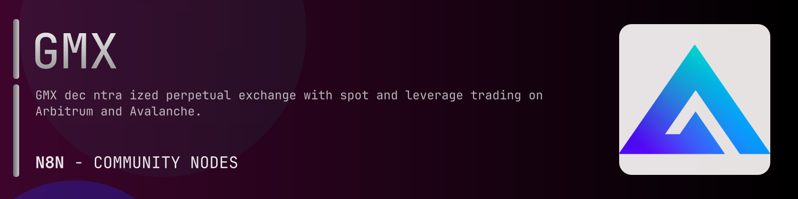

# @n8n-dev/n8n-nodes-gmx



[](https://www.npmjs.com/package/@n8n-dev/n8n-nodes-gmx)
[](https://opensource.org/licenses/MIT)

---

**Stop writing gmx API integrations by hand.**

Every time you connect n8n to gmx, you waste hours mapping endpoints, defining parameters, and debugging schemas. You copy-paste from docs, fix edge cases, and pray nothing breaks.

**What if connecting n8n to gmx took 5 minutes, not half a day?**

This node gives you **21+ resources** out of the box: **Yield**, **Trades**, **Tokens**, **Subaccounts**, **Staking**, and 16 more: with full CRUD operations, typed parameters, and zero manual configuration.

---

## What You Get

- **Zero boilerplate**: Resources, operations, and fields are pre-configured and ready to use
- **Full CRUD**: Create, read, update, and delete support where the API allows it
- **Typed parameters**: No more guessing field types
- **Built-in auth**: API key authentication, ready to go
- **Declarative**: Native n8n performance, no custom execute() overhead

---

## Install

```bash
npm install @n8n-dev/n8n-nodes-gmx
```

**Or in n8n:**
1. **Settings → Community Nodes → Install**
2. Search: `@n8n-dev/n8n-nodes-gmx`
3. Click **Install**

---

## Quick Start

1. Install the node (above)
2. Add credentials: **gmx API** → paste your API key
3. Drag the **gmx** node into your workflow
4. Pick a resource → pick an operation → done.

That's it. No configuration files. No code. It just works.

---

## Resources

<details>
<summary><b>Yield</b> (1 operations)</summary>

- Get Gm Pools Yield Pnl

</details>

<details>
<summary><b>Trades</b> (2 operations)</summary>

- Get Trades
- Post Search Trades

</details>

<details>
<summary><b>Tokens</b> (2 operations)</summary>

- Get Tokens
- Get Tokens Info

</details>

<details>
<summary><b>Subaccounts</b> (2 operations)</summary>

- Post Fetch Status
- Post Prepare Approval

</details>

<details>
<summary><b>Staking</b> (1 operations)</summary>

- Get Staking Power

</details>

<details>
<summary><b>Risk Oracle</b> (1 operations)</summary>

- Get Markets

</details>

<details>
<summary><b>Relay</b> (2 operations)</summary>

- Post Submit
- Post Status

</details>

<details>
<summary><b>Rates</b> (1 operations)</summary>

- Get Rates

</details>

<details>
<summary><b>Prices</b> (1 operations)</summary>

- Get Ohlcv

</details>

<details>
<summary><b>Positions</b> (2 operations)</summary>

- Get Positions Info
- Get Position By Key

</details>

<details>
<summary><b>Performance</b> (2 operations)</summary>

- Get Annualized
- Get Snapshots

</details>

<details>
<summary><b>Pairs</b> (1 operations)</summary>

- Get Pairs

</details>

<details>
<summary><b>Orders</b> (2 operations)</summary>

- Get Orders By Address
- Get Order By Key

</details>

<details>
<summary><b>Order Transactions</b> (6 operations)</summary>

- Post Prepare
- Post Submit
- Post Status
- Post Edit Prepare
- Post Cancel Prepare
- Post Collateral Prepare

</details>

<details>
<summary><b>Markets</b> (6 operations)</summary>

- Get Markets
- Get Markets Tickers
- Get Trading Capacity
- Get Markets Info
- Get Markets Config
- Get Markets Values

</details>

<details>
<summary><b>JIT</b> (2 operations)</summary>

- Get Liquidity Info
- Get Liquidity History

</details>

<details>
<summary><b>GMX Account</b> (4 operations)</summary>

- Post Prepare Cross Chain Deposit
- Post Prepare Cross Chain Withdraw
- Post Submit Cross Chain Withdraw
- Post Status Cross Chain Withdraw

</details>

<details>
<summary><b>Buyback</b> (1 operations)</summary>

- Get Weekly Stats

</details>

<details>
<summary><b>Balances</b> (1 operations)</summary>

- Get Wallet Balances

</details>

<details>
<summary><b>APY</b> (1 operations)</summary>

- Get Apy

</details>

<details>
<summary><b>Allowances</b> (1 operations)</summary>

- Get Allowances

</details>

---

## Why This Node?

**Without this node:**
- Hours of manual API integration
- Copy-pasting from gmx docs
- Debugging auth, pagination, error handling
- Maintaining your own client code

**With this node:**
- Install → configure → use. 5 minutes.
- Auto-generated from the official gmx OpenAPI spec
- Always up to date when the API changes
- Native n8n performance

---

## Auto-Generated
This node was auto-generated from the official **gmx** OpenAPI specification using
[@n8n-dev/n8n-openapi-node-ultimate](https://github.com/kelvinzer0/n8n-openapi-node-ultimate),
then validated against the live API so you get accurate types and real parameters, not guesswork.

When the gmx API updates, this node updates too.

---


## License

MIT © [kelvinzer0](https://github.com/n8n-code)
